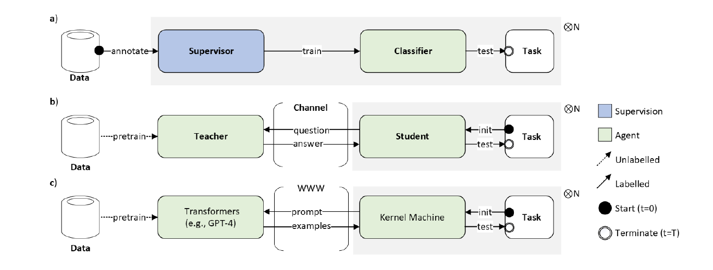
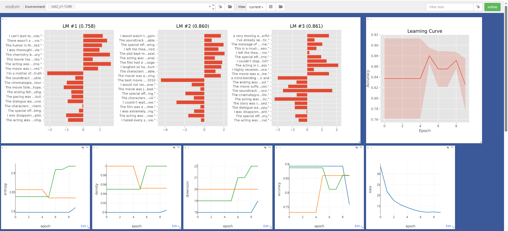

# Support Vector Generation (SVG): Enterprise AI Generator for SLMs

[](https://opensource.org/licenses/MIT)




This is an enterprise-grade generative AI tool that automatically develops document detection and text binary-classification AI models (Small Language Models / SLMs) without requiring a GPU. When you input a task via a prompt, it automatically writes code and outputs an agent (SLM) to solve it. For example, it can be used to determine the positive/negative sentiment of corporate reputation on social media, or to detect internal fraud based on PC email contents (like the Enron scandal). As it provides a Python module, integration into third-party enterprise applications is also possible.

*Note: For the Japanese README, please see [README_ja.md](README_ja.md).*

## Features
- In addition to fast and highly accurate AI generation, it includes a comprehensive debugging mode that visualizes the thought process (PDCA cycle) to support a transparent development lifecycle.
- Functions as Explainable AI (XAI) by visualizing support vectors (generated training data) and outputting example sentences. This supports auditing in line with global standards for responsible AI and enables specifications that consider ethics and eliminate bias.

### Functions
- Task-based SLM generation
- Binary/Multi-class classification (OVO, OVR)
- Single sentence / Double sentence
- Visualization of the generated language model (LM)
- Visualization of AI development progress (PDCA cycle / accuracy charts)
- Jupyter Notebook for developers

## Environment Requirements
- **(Required):** CPU 1 GHz, Memory 1GB, OS Windows/MacOS/Linux, Python 3.11+, Open AI Completion API, Docker
- **(Recommended):** Linux, Visdom, Jupyter Notebook/Lab

### Dependencies
- Dependecies can be installed via `pip install -r requirements.txt`. Includes numpy, scipy, openai (v1.0.0+), etc.

## Installation
## Installation and Usage

1. **Clone the repository and prepare the environment file:**
```bash
$ git clone git@github.com:Ohsaworks/svg.git
$ cd svg
$ cp .env.example .env
```

2. **Set your OpenAI credentials in the `.env` file:**
Open `.env` and assign your API key (`OPENAI_API_KEY`). Alternatively, you can skip this step and provide the key interactively via a prompt when running the script.

3. **Build the Docker container:**
```bash
$ docker build -t svg-ai .
```

4. **Run the container**:
```bash
$ docker run -d --name svg-visdom -p 3000:3000 -v .:/app svg-ai
```

5. **Start training and testing within the container:**
```bash
$ docker exec -it svg-visdom python3 /app/src/run.py sst2
```
> **Note**: On the first execution, the script will automatically download the validation dataset and fetch the necessary OpenAI embeddings. This initialization step might take a few minutes before the actual training begins.
Furthermore, you can monitor the training progress by accessing http://localhost:3000/


## Additional Notes
- A paid OpenAI account is required for API access during training.
- Operation has been confirmed on an AWS EC2 Large instance as of September 2023.

## Versions
### v1.4 Changes (2026-04-15)
- Beta release.

### v1.3 Changes (2026-03-21)
- Refactored repository structure for OSS release (`src/` and `tests/` directories).
- Removed hardcoded API credentials and migrated to OpenAI v1.0.0+ API.
- Added standard OSS community files (`LICENSE`, `CONTRIBUTING.md`, Issue templates).
- Introduced GitHub Actions for automated testing and PEP8 compliance using Ruff.
- Added official paper citations and documented core algorithms.

### v1.2 Changes (2026-03-08)
- Added Docker containerization to simplify the environment setup.

## Citation
If you use this software, please cite the following paper:
```bibtex
@inproceedings{ohsawa2025svg,
  title={Support Vector Generation: Kernelizing Large Language Models for Efficient Zero-Shot {NLP}},
  author={Shohei Ohsawa},
  booktitle={Advances in Neural Information Processing Systems},
  year={2025},
  url={https://openreview.net/forum?id=upU88pUpzX}
}
```

## Author
Shohei Ohsawa (shohei.ohsawa@iyp.co.jp)
